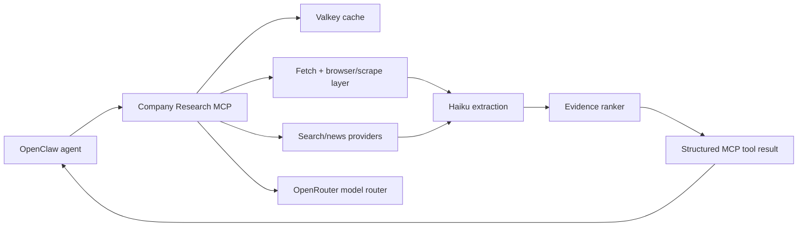

# Company Research MCP Server

Standalone MCP server for interview-prep company research. This repository is scoped to the custom research MCP only; the OpenClaw agent, Gmail MCP, Slack MCP, and deployment automation live outside this project.

## Quick Start

1. Copy environment template:
   - `cp .env.example .env`
2. Set required keys in `.env`:
   - `TAVILY_API_KEY` (needed for `recent_news`)
   - `OPENROUTER_API_KEY` (reserved for upcoming extractor/synthesis model calls)
3. Start services:
   - `make up`
4. Check health:
   - `make health` or `curl http://localhost:8080/healthz`
5. Stop services:
   - `make down`

The FastAPI service exposes MCP over HTTP at `http://localhost:8080/mcp`.

### Make Targets

- `make build` build images
- `make up` start `company-api` and `valkey`
- `make down` stop stack
- `make restart` recreate stack
- `make logs` follow logs
- `make ps` show service status
- `make clean` remove containers + volumes
- `make test` run `pytest`

## Goal

Expose a small set of reliable, cached research tools that an OpenClaw agent can call after it detects an interview invitation:

- `company_profile(domain)`
- `recent_news(company, days)`
- `linkedin_lookup(name, company?)`
- optional later: `interview_brief(company, domain, interviewer_name?, role?)`

The server should return structured evidence with source URLs, timestamps, confidence scores, and enough extracted text for the agent to synthesize a brief.

## Proposed Architecture



## Runtime Shape

Recommended compose services for this repo:

- `company-mcp`: Python MCP server exposing Streamable HTTP at `/mcp`.
- `valkey`: shared cache for fetched pages, search results, LinkedIn lookup attempts, LLM extraction outputs, and rate-limit buckets.
- `worker` or `browser`: optional second app service for heavier scraping/browser work. If we keep the first version lean, this can be omitted until dynamic-page scraping is needed.

For the assignment-wide Docker Compose requirement, OpenClaw core would be a separate service in the parent deployment. Inside this repo, the clean minimum is `company-mcp + valkey`; if the assignment wants this repo alone to show three services, add a `research-worker` service early.

## Language Baseline

Use Python 3.14.4 as the project baseline. Python 3.15.0a8 exists as a developer preview as of April 2026, but it is still alpha-stage and not a production target.

## Selected Tech Stack

- Package/project manager: `uv`
- MCP framework: `FastMCP`
- Transport: HTTP only, exposed at `/mcp`
- Web runtime: FastAPI + Uvicorn, mounting the FastMCP ASGI app
- Validation/config models: Pydantic
- HTTP client: `httpx`
- Cache service: Valkey
- Browser automation: Playwright
- Search/news provider: Tavily, called through raw `httpx`
- Model provider: OpenRouter, called through raw `httpx`

Tavily is the first search/news provider because it keeps setup light: one API key, one search endpoint, `topic=news` support, day/date filters, and no extra SDK dependency. It still sits behind a provider interface so Brave Search, SerpAPI, or another source can replace it later.

## Extractor Pipeline Strategy

The server should support multiple extractor pipelines behind a common interface so we can run A/B tests on the same fetched documents:

- `metadata`: deterministic extraction from title, meta tags, Open Graph, Twitter cards, schema.org JSON-LD, and canonical links.
- `readability`: article/body extraction for pages with dense text.
- `dom_rules`: custom selectors and heuristics for company homepages, `/about`, `/careers`, `/team`, and press pages.
- `llm_extract`: Haiku-class OpenRouter extraction over cleaned page text.
- `browser_snapshot`: Playwright-rendered page extraction for JavaScript-heavy pages.

Each tool call should be able to select a pipeline explicitly, or use `auto`, where the server tries cheap deterministic extraction first and escalates only when confidence is low.

## Tool Contracts

### `company_profile(domain)`

Input:

```json
{
  "domain": "example.com",
  "max_pages": 8,
  "freshness_hours": 168
}
```

Output:

```json
{
  "company": {
    "name": "Example Inc.",
    "domain": "example.com",
    "description": "...",
    "industry": "...",
    "products": ["..."],
    "hq": "...",
    "size": "...",
    "careers_url": "...",
    "linkedin_url": "..."
  },
  "confidence": 0.82,
  "sources": [
    {
      "url": "https://example.com/about",
      "title": "About Example",
      "retrieved_at": "2026-04-27T00:00:00Z",
      "evidence": "short extracted evidence"
    }
  ],
  "warnings": []
}
```

Implementation:

- Resolve homepage, `/about`, `/careers`, `/team`, sitemap, Open Graph metadata, and schema.org JSON-LD.
- Extract with the cheap model profile, then normalize deterministically.
- Cache by canonical domain and extraction version.

### `recent_news(company, days)`

Input:

```json
{
  "company": "Example",
  "domain": "example.com",
  "days": 30,
  "limit": 8
}
```

Output:

```json
{
  "items": [
    {
      "title": "...",
      "url": "...",
      "published_at": "2026-04-20T00:00:00Z",
      "source": "TechCrunch",
      "summary": "...",
      "relevance": 0.91
    }
  ],
  "query_used": "Example company news",
  "confidence": 0.74
}
```

Implementation:

- Use Tavily as the first provider, behind a pluggable interface so Brave Search, SerpAPI, Bing, or NewsAPI can be swapped in later.
- Deduplicate by canonical URL and title similarity.
- Require source URL and publication date when possible.
- Return "no strong result" rather than hallucinating.

### `linkedin_lookup(name, company?)`

Input:

```json
{
  "name": "Jane Doe",
  "company": "Example",
  "title_hint": "Engineering Manager"
}
```

Output:

```json
{
  "matches": [
    {
      "name": "Jane Doe",
      "headline": "Engineering Manager at Example",
      "url": "https://www.linkedin.com/in/...",
      "company_match": true,
      "confidence": 0.78,
      "evidence": ["name exact match", "company in headline"]
    }
  ],
  "warnings": ["LinkedIn data is search-result-derived; profile details may be incomplete."]
}
```

Implementation:

- Do not scrape authenticated LinkedIn pages or bypass access controls.
- Use search snippets and public pages only, or an approved enrichment provider.
- Return ranked candidates with confidence, not a single asserted identity.

## Internal Modules

- `mcp/`: tool registration, JSON schemas, transport setup.
- `providers/`: Tavily search/news, homepage fetch, LinkedIn lookup, optional enrichment APIs.
- `extractors/`: swappable extraction pipelines, HTML readability, metadata parsing, LLM extraction prompts, schema validation.
- `models/`: OpenRouter client with named profiles: `cheap_extract` and `quality_synthesis`.
- `cache/`: Redis keys, TTLs, stale-while-revalidate behavior.
- `ranking/`: source reliability, recency, domain/name matching, confidence scoring.
- `observability/`: request IDs, structured logs, timing, provider costs, cache hit rate.

## Multi-Model Design

Even though the OpenClaw agent will generate the final user-facing Slack message, this server should own extraction quality:

- `cheap_extract`: Haiku-class model via OpenRouter for page extraction, article summarization, and snippet normalization.
- `quality_synthesis`: Opus-class model via OpenRouter for optional `interview_brief` or deep company synthesis if we expose that later.

Model IDs should be environment variables, not hard-coded, because OpenRouter model names and preferred versions change.

## Caching Policy

- Homepage/profile pages: 7 days.
- News search result pages: 1-6 hours depending on `days`.
- Extracted article summaries: 30 days by URL + extraction prompt version.
- LinkedIn search results: 7 days, with explicit warning that they may be stale.
- Negative lookups: short TTL, around 1 hour.

## Failure Model

The MCP server should degrade explicitly:

- Provider timeout: return partial results and warning.
- Source ambiguity: return candidates with confidence.
- Rate limit: return cached stale data if available.
- Extraction failure: return raw source metadata and warning.
- No evidence: return empty result, not fabricated content.

## Testing Strategy

Test against the assignment criterion probabilistically:

- Build a fixture set of 50-100 historical interview invitation examples with known company/interviewer fields.
- Replay each case through the MCP tools without Gmail/Slack/OpenClaw.
- Measure:
  - `brief_inputs_ready_under_10m`
  - company profile usefulness
  - news relevance
  - interviewer candidate precision at top 1/top 3
  - source coverage
  - cache hit rate
  - cost per invitation
- Target: at least 80% of cases produce useful research inputs within 10 minutes.

## Security And Compliance

- Validate all tool inputs with JSON Schema.
- Allowlist outbound protocols: `https` only except local development.
- Block private IP ranges and localhost fetches to avoid SSRF.
- Apply per-domain and per-provider rate limits.
- Keep API keys in environment variables.
- Log source URLs and timings, not private invitation email bodies.
- Respect robots.txt and provider terms where applicable.

## Sources Checked

- MCP transport spec: https://modelcontextprotocol.io/specification/2025-03-26/basic/transports
- MCP tools spec: https://modelcontextprotocol.io/specification/2025-03-26/server/tools
- OpenRouter model routing/model list reference: https://openrouter.ai/openrouter/auto/overview
